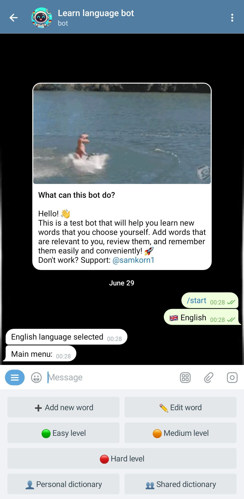
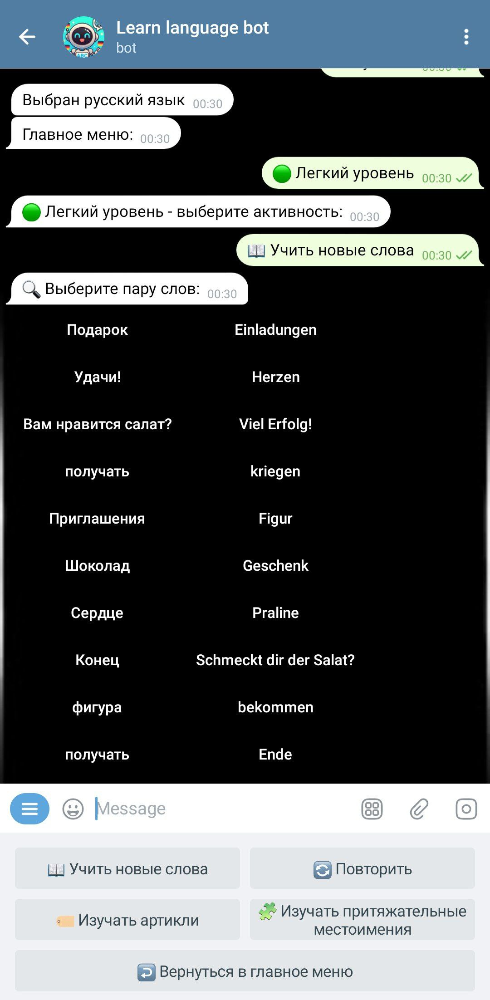

# German Words Learning Bot

<p align="center">
<!-- Project banner or logo -->

</p>

> **⚠️ Disclaimer:**
> This bot contains many bugs and unfinished features. The codebase has legacy parts and is under active refactoring. Use with caution and feel free to contribute or report issues!

A Telegram bot designed for the effective learning of German words. It offers a personalized approach to learning, supports collaboration, and has flexible settings for users of all levels.

---

## 🌟 Key Features

- **📚 Personal and Shared Dictionaries**: Create your own dictionaries or join existing ones to learn collaboratively with friends or colleagues.
- **🎯 Three Difficulty Levels**: Choose a level (easy, medium, hard) that matches your knowledge and complete corresponding exercises.
- **🏷️ Article Learning**: Special exercises to memorize the correct articles (`der`, `die`, `das`).
- **🧩 Diverse Games**: Exercises for choosing the correct spelling, filling in the blanks, finding pairs, and learning possessive pronouns.
- **🌍 Multilingual Support**: The interface is translated into Ukrainian, English, Russian, Turkish, and Arabic.
- **📊 Progress Tracking**: A word rating system helps adapt the learning process by offering more challenging words more frequently.
- **➕ Bulk Add and Delete**: Easily manage your dictionaries with bulk add and delete functions.

---

## 🖼️ Gallery

<p align="center">
  
  
</p>

---

## 🚀 Deployment & Setup

### 1. Environment Preparation

Ensure you have Python 3.6+ and all necessary dependencies installed.

```bash
# Install dependencies
pip install -r requirements.txt
```

### 2. Configuration

Create a `.env` file in the root directory and add the following variables:

- `BOT_TOKEN` - Your Telegram bot token.
- `ADMIN_ID` - Your Telegram ID for access to administrative functions.

### 3. Initialization and Diagnostics

Before the first launch, it is recommended to check the project and database status.

```bash
# Check deployment readiness
python check_deployment.py

# Diagnose the database
python diagnose_database.py

# Create a backup (recommended)
python backup_database.py
```

### 4. Running the Bot

```bash
python main.py
```

### 5. Server Deployment (Production)

For stable operation on a server, it is recommended to use a process manager like `PM2` or `systemd`.

```bash
# Example of running with PM2
pm2 start main.py --name "german-bot" --interpreter python3
pm2 save
pm2 startup
```

---

## 🗃️ Database

The project uses a **SQLite** database (`german_words.db`), which contains:
- **`words`**: The main table with words, translations, and links to articles.
- **`article`**: A table with articles (`der`, `die`, `das`).
- **`users`**: Information about users, their settings, and progress.
- **`possessive_articles`**: A table with possessive pronouns for exercises.
- **`shared_dictionaries`**: Information about shared dictionaries.
- **`shared_dict_*`**: Tables with words for each shared dictionary.
- **`user_*`**: Personal dictionaries for each user.

---

## 🛠️ Project Structure

```
├── main.py                 # Main file to run the bot
├── config.py               # Configuration and settings
├── db_manager.py           # Functions for interacting with the database
├── handlers/               # Handlers for user commands and messages
│   ├── easy_level.py
│   ├── medium_level.py
│   └── hard_level.py
├── utils/                  # Helper functions (keyboards, validation, etc.)
├── locales/                # Localization files for multilingual support
├── database/               # SQLite database file
└── logs/                   # Bot operation logs
```

---

## 🤝 Contributing

We welcome any contributions to the project's development. If you have ideas for improvement, feel free to create a fork and submit a pull request.

---

## 📄 License

This project is licensed under the MIT License. See the `LICENSE` file for details.

---

## 👨‍💻 Developer

- **Samuill**: [GitHub Profile](https://github.com/Samuill)